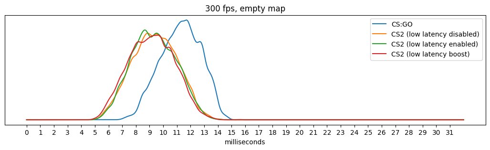
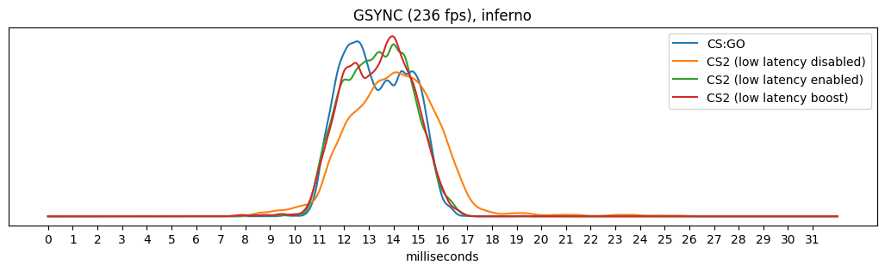
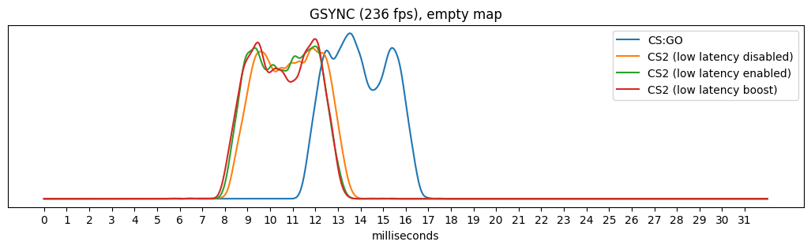
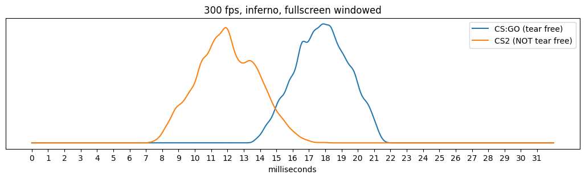

# CS2 Input Lag Analysis

My attempt at comparing CS:GO and CS2 mouse movement input lag.

## Setup

- Monitor: BenQ ZOWIE XL2540K @ 240 Hz (DyAc off)
- OS: Windows 10 Enterprise LTSC 2021 (21H2)
- CPU: Intel i7 8700k @ 4.8 GHz
- GPU: NVIDIA GTX 1080 Ti
- RAM: Corsair VENGEANCE DDR4 (2x8GB) @ 3200 MHz

## Notes

- All other monitors are disabled
- Everything in the NVIDIA control panel is set to default (except for the frame limiter that I'll be using)
- Lowest possible graphics settings in both games at 1080p
- Resolution scaling in CS2 is disabled
- No browser/Discord/Spotify were running in the background

## Apparatus

It's just an Arduino Pro Micro that acts as a mouse with a photoresistor soldered onto it. 
The photoresistor is enclosed to minimize other lights affecting the measurements.

## Logic ([code](arduino.cpp))

### Calibrate

Calibration happens every 250 samples.

1. Aim at a spot that's dark
1. Read out and average measurements for 1 second (reduce noise) 
1. Aim at a spot that's bright
1. Read out and average measurements for 1 second (reduce noise)
1. The baseline for dark is at 5% between dark and bright measurements
1. The baseline for bright is at 20% between dark and bright measurements

### Measure one sample

1. Aim at a spot that's dark
1. Wait till the measurement goes below the baseline for dark
1. Delay for a random amount of time
1. Start measuring time
1. Aim at a spot that's bright
1. Wait till the measurement is above the baseline for bright
1. Stop measuring time

## Graphs

---
---

## Tear Free Graphs

---
---

